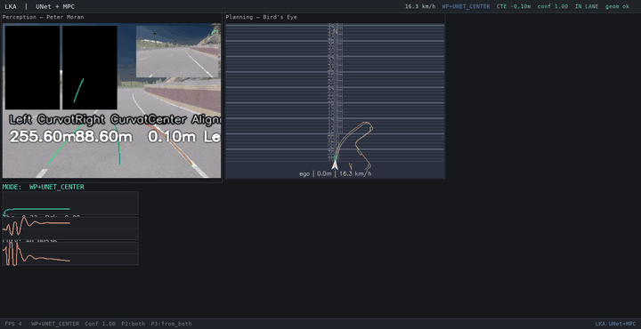
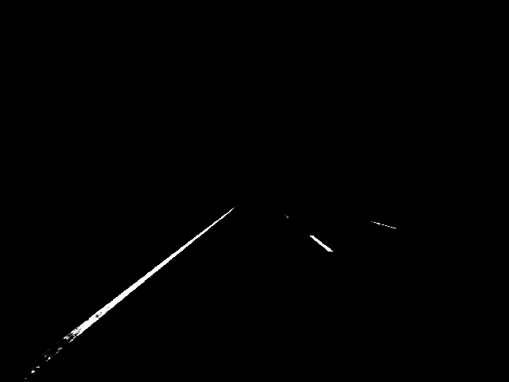
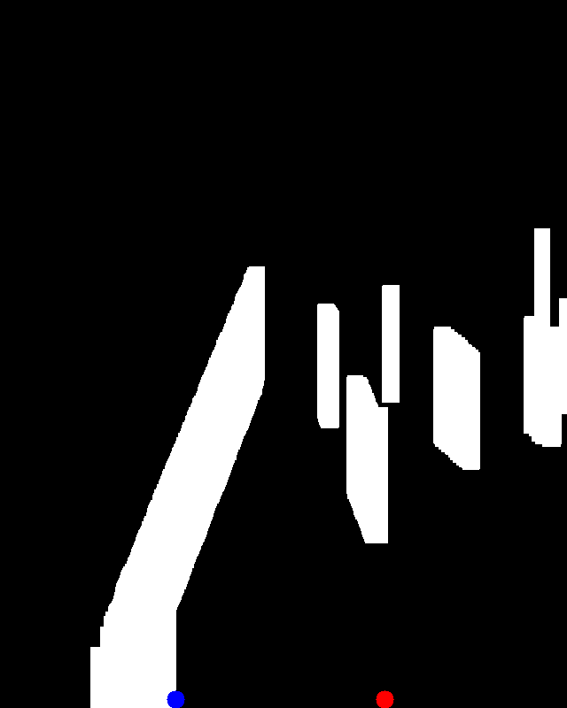
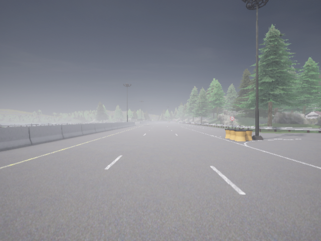
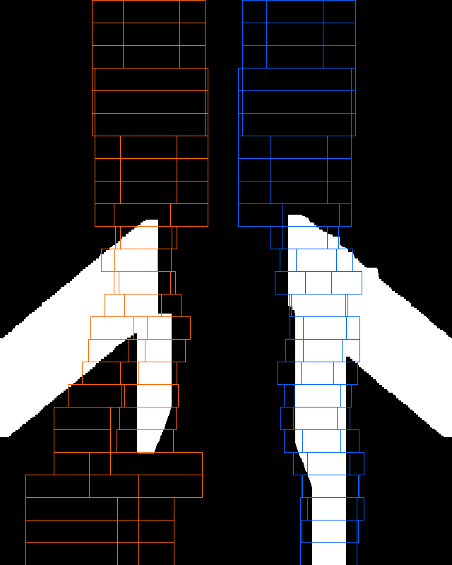
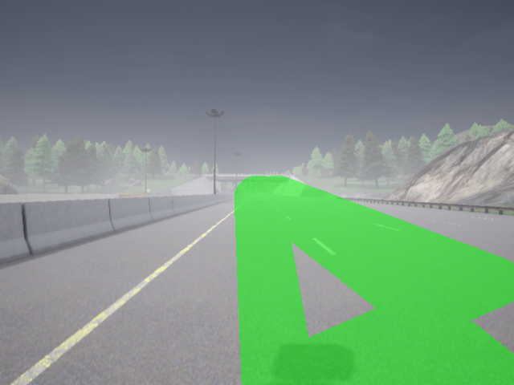
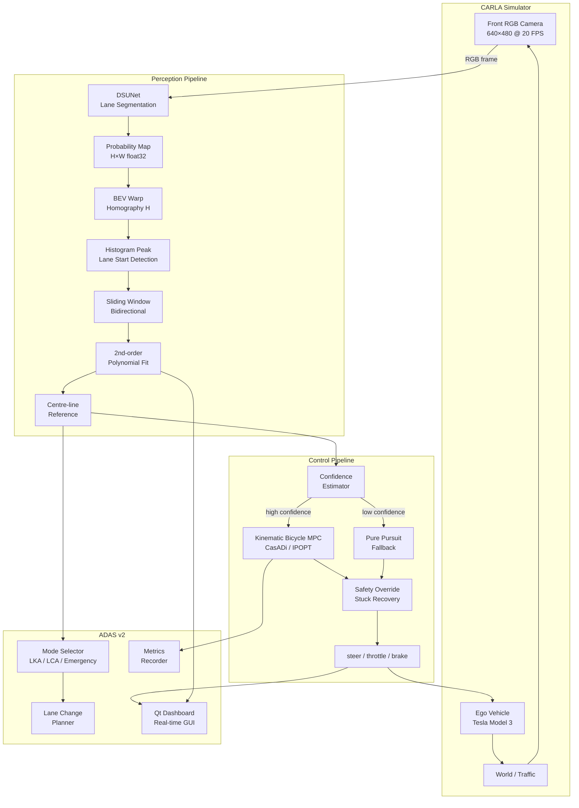

# FrontView Predictive Control


**Front-view camera lane detection + Model Predictive Control (MPC) for lane-keeping and ADAS in CARLA 0.9.16.**

The system fuses a deep neural network lane segmentation (DSUNet) with a classical Kinematic Bicycle MPC controller. A Bird's Eye View (BEV) perspective transform connects the two, giving the MPC accurate, geometry-consistent lane references extracted purely from a forward-facing RGB camera.

---

## Live Demo

**ADAS Dashboard — latest run (2026-03-03)**



**BEV Lane Detection Pipeline — step-by-step processing**



**BEV Lane Tracking across 5 frames**



---

## Overview

| Component | Technology |
|-----------|-----------|
| Lane segmentation | DSUNet (Depthwise Separable U-Net) |
| BEV transform | OpenCV perspective warp |
| Lane fitting | Sliding window + 2nd-order polynomial |
| Lateral control | Kinematic Bicycle MPC (CasADi / IPOPT) |
| Fallback control | Pure Pursuit |
| Safety layer | Stuck recovery + safety override |
| Dashboard | PyQt5 real-time GUI |
| Simulator | CARLA 0.9.16 |

---

## Features

- **End-to-end front-view pipeline** — RGB camera → lane mask → BEV → polynomial → MPC → steering/throttle
- **DSUNet** — 5.16× lighter and 1.61× faster than standard U-Net with comparable accuracy
- **Adaptive MPC horizon** — dynamically adjusts from N=8 (sharp curves) to N=12 (straights/high speed)
- **Weight-adaptive cost function** — cross-track error weight increases in curves and at high speed
- **BEV perspective warp** — 640×640 Bird's Eye View with extended horizon (lookahead ~50 m)
- **Sliding-window lane fitting** — histogram + bidirectional window search with Kalman smoothing
- **Pure Pursuit fallback** — activates when MPC confidence is low or solver fails
- **ADAS v2 suite** — lane change, multi-lane tracking, mode selector, metrics recorder
- **Real-time Qt dashboard** — live lane overlay, MPC trajectory, diagnostics, logging panel
- **GPU-accelerated BEV** — optional CUDA tensor-based perspective transform

---

## Tech Stack

| Component | Version |
|-----------|---------|
| Python | 3.10+ |
| PyTorch | 2.x |
| CasADi | 3.6+ |
| IPOPT | ≥ 3.14 (via CasADi) |
| OpenCV | 4.8+ |
| PyQt5 | 5.15+ |
| NumPy / SciPy | latest |
| CARLA Simulator | 0.9.16 |

---

## Physics & Mathematics

### 1. Kinematic Bicycle Model

The MPC uses a **kinematic bicycle model** (no-slip assumption, valid at low-to-medium speed):

$$\dot{x} = v \cos(\psi)$$
$$\dot{y} = v \sin(\psi)$$
$$\dot{\psi} = \frac{v}{L} \tan(\delta)$$
$$\dot{v} = a$$

where:
- \((x, y)\) — vehicle position in world frame
- \(\psi\) — vehicle heading (yaw)
- \(v\) — longitudinal speed (m/s)
- \(\delta\) — front-wheel steering angle (rad)
- \(a\) — longitudinal acceleration (m/s²)
- \(L\) — wheelbase (fixed at vehicle model value)

**Discrete-time form** (Euler, step \(\Delta t\)):

$$x_{k+1} = x_k + v_k \cos(\psi_k)\,\Delta t$$
$$y_{k+1} = y_k + v_k \sin(\psi_k)\,\Delta t$$
$$\psi_{k+1} = \psi_k + \frac{v_k}{L}\tan(\delta_k)\,\Delta t$$
$$v_{k+1} = v_k + a_k\,\Delta t$$

---

### 2. MPC Optimal Control Problem

At each control step the MPC solves:

$$\min_{\mathbf{u}} \sum_{k=0}^{N-1} \left[ w_\text{cte}\,e_\text{cte}^2 + w_\psi\,e_\psi^2 + w_v\,(v_k - v_\text{ref})^2 + w_\delta\,\delta_k^2 + w_a\,a_k^2 + w_{\dot\delta}\,(\delta_{k+1}-\delta_k)^2 + w_{\dot a}\,(a_{k+1}-a_k)^2 \right]$$

subject to:

$$|\delta_k| \leq \delta_{\max} = 0.7\ \text{rad}$$
$$|\delta_{k+1} - \delta_k| \leq \dot\delta_{\max}$$
$$a_{\min} \leq a_k \leq a_{\max}$$
$$\text{Bicycle dynamics } \forall k \in [0, N-1]$$

**State vector**: \(\mathbf{x}_k = [x,\, y,\, \psi,\, v]^\top\)

**Control vector**: \(\mathbf{u}_k = [\delta,\, a]^\top\)

**Errors**:
- Cross-track error: \(e_\text{cte} = \) lateral distance from ego centre to reference polynomial
- Heading error: \(e_\psi = \psi - \arctan(p'(s))\) where \(p(s)\) is the reference polynomial

---

### 3. Adaptive MPC Weights

Weights adapt based on speed \(v\) and lane curvature \(\kappa\):

$$w_\text{cte} = 1 + 1.2\,\kappa_\text{norm} + 0.5\,v_\text{norm}$$
$$w_\psi = 1 + 0.8\,\kappa_\text{norm} + 0.3\,v_\text{norm}$$
$$w_{\dot\delta} = 1 + 0.5\,\kappa_\text{norm} - 0.3\,v_\text{norm}$$

where \(\kappa_\text{norm} = \min(1,\,|\kappa|\times 50)\) and \(v_\text{norm} = \min(1,\,v/v_\text{high})\).

**Insight**: higher \(|\kappa|\) → increase CTE weight to track curves accurately; higher speed → increase CTE and heading weight to compensate for inertia lag.

---

### 4. Adaptive Horizon

$$N = \begin{cases} N_\text{high} = 12 & \text{if } |\kappa| < 0.025 \text{ and } v \geq 0.7\,v_\text{high} \\ N_\text{low} = 8 & \text{otherwise} \end{cases}$$

---

### 5. Dynamic Lookahead

Reference path is sampled along a dynamic lookahead distance:

$$L_\text{ahead} = \max\bigl(L_\text{min},\; v \cdot T_\text{ahead}\bigr)$$

where \(L_\text{min} = 6\) m and \(T_\text{ahead} = 1.5\) s.

---

### 6. Pure Pursuit Steering Angle

When MPC confidence is low, Pure Pursuit computes steering as:

$$\delta = \arctan\!\left(\frac{2 L \sin\alpha}{L_d}\right)$$

where:
- \(L_d\) — lookahead distance to target waypoint
- \(\alpha\) — angle between vehicle heading and line to target point
- \(L\) — wheelbase

---

### 7. BEV Perspective Transform

The forward camera image is warped to a top-down (Bird's Eye View) using a homography \(H\):

$$\mathbf{p}_\text{BEV} = H \cdot \mathbf{p}_\text{cam}$$

Source trapezoid (640×480 camera):

| Point | x | y |
|-------|---|---|
| Top-left | 140 | 220 |
| Top-right | 500 | 220 |
| Bottom-right | 625 | 475 |
| Bottom-left | 15 | 475 |

Destination rectangle (640×640 BEV canvas) covers approximately **50 m ahead** and **±8 m lateral**, giving a scale of roughly **0.078 m/pixel**.

---

### 8. Lane Polynomial Reference

Left and right lane boundaries are fitted as **2nd-order polynomials** in BEV space:

$$x_\text{lane}(y) = a_2 y^2 + a_1 y + a_0$$

The **centre-line** reference for MPC is:

$$x_\text{ref}(y) = \frac{x_\text{left}(y) + x_\text{right}(y)}{2}$$

Curvature is estimated from the leading coefficient:

$$\kappa \approx 2\,a_2$$

---

## AI Architecture — DSUNet

### Standard U-Net vs DSUNet

| Property | Standard U-Net | DSUNet |
|----------|---------------|--------|
| Conv type | Standard 3×3 | Depthwise Separable |
| Model size | 31.0 M params | ~6.0 M params (**5.16×** lighter) |
| Inference speed | baseline | **1.61×** faster |
| IoU (CARLA test) | — | **0.861** |
| Dice score | — | **0.916** |

### Architecture Diagram

```
Input RGB (3 × H × W)
        │
   ┌────▼────┐
   │ Encoder │  (DSBlock × 4)
   │  Down   │  channels: 3→64→128→256→512
   └────┬────┘
        │ skip connections
   ┌────▼────┐
   │ Bottleneck│  (DSBlock, 512→1024)
   └────┬────┘
        │
   ┌────▼────┐
   │ Decoder │  (Up + Cat + DSBlock × 4)
   │   Up    │  channels: 1024→512→256→128→64
   └────┬────┘
        │
   ┌────▼──────────┐
   │ Output Conv   │  1×1 Conv → sigmoid
   │ (1 channel)   │
   └───────────────┘
   Lane probability mask (H × W)
```

### Depthwise Separable Convolution

Standard 3×3 conv: \(C_\text{in} \times C_\text{out} \times 3 \times 3\) multiplications

Depthwise separable = Depthwise + Pointwise:

$$\text{Cost}_\text{DSConv} = C_\text{in} \cdot 3^2 + C_\text{in} \cdot C_\text{out} \cdot 1$$

$$\text{Reduction ratio} = \frac{1}{C_\text{out}} + \frac{1}{9} \approx 8–9\times \text{ per layer}$$

Each DSBlock contains:
```
DepthwiseSeparableConv → BN → ReLU → DSConv → BN → ReLU
```

### DSUNet Evaluation Results

From `dsunet_training/eval_results/latest/test_results.json`:

| Metric | Mean | Std |
|--------|------|-----|
| IoU | **0.861** | 0.142 |
| Dice / F1 | **0.916** | 0.127 |
| Precision | **0.940** | 0.114 |
| Recall | **0.904** | 0.111 |

---

## Detection Results

**Front-view RGB input → BEV lane detection (spawn point 16)**

| RGB Input | BEV Lane Detection |
|-----------|-------------------|
|  |  |

**Ego-lane mask overlay**



---

## System Architecture & Workflow



### Step-by-step Workflow

1. **Frame capture** — CARLA provides 640×480 RGB at 20 FPS via synchronous mode
2. **DSUNet inference** — frame is resized to 256×256, passed through DSUNet; output is upsampled back to 640×480 probability map
3. **Thresholding** — probability map thresholded at 0.08 to handle faint dashed markings
4. **Morphological ops** — dilate (vertical 80 px, horizontal 8 px) → close (large kernel) to connect dashed lines
5. **BEV warp** — perspective homography H warps 640×480 → 640×640 top-down view
6. **Histogram** — column-wise sum in lower half detects left/right lane peak positions
7. **Sliding windows** — N=25 windows track lane pixels bidirectionally; recentre if ≥2 pixels found
8. **Polynomial fit** — RANSAC-like 2nd-order poly fit on each lane; outliers removed by width constraint
9. **EMA smoothing** — α=0.6 exponential moving average on lateral values to reduce jitter
10. **Centre-line** — average of left/right poly evaluated at each look-ahead s position
11. **Confidence** — estimated from pixel count, poly residuals, and lane width consistency
12. **MPC solve** — CasADi/IPOPT solves the OCP over N steps; returns optimal δ, a
13. **Pure Pursuit fallback** — if MPC fails or confidence < threshold, Pure Pursuit takes over
14. **Safety layer** — override brakes if obstacle too close; stuck detector issues reverse manoeuvre
15. **ADAS mode** — Mode Selector chooses LKA, lane-change, or emergency based on context

---

## Project Structure

```
carla_mpc_classical/
├── main.py                    # Main entry point (Qt dashboard)
├── pipeline.py                # Core pipeline orchestrator
├── run_unet_mpc.py            # Headless MPC + U-Net runner
├── config.py / config.yaml    # All tunable parameters
├── carla_input_output.py                # CARLA client / sensor setup
├── state.py                   # Shared vehicle state dataclass
│
├── perception/                # Perception modules
│   ├── lane_detector.py       # U-Net lane detector + post-processing
│   ├── birds_eye_view_lane_pipeline.py   # BEV warp + sliding-window + poly fit
│   ├── ego_lane_tracker.py    # Ego-lane Kalman tracker
│   ├── kalman_lane_tracker.py # General Kalman filter for lanes
│   ├── lane_trajectory.py     # Reference trajectory builder
│   ├── road_perception.py     # Road surface perception
│   ├── gpu_bev_transform.py   # CUDA-accelerated BEV
│   └── unet/                  # U-Net model weights loader
│
├── control/
│   ├── lane_mpc.py            # Kinematic Bicycle MPC (CasADi)
│   └── pure_pursuit.py        # Pure Pursuit fallback controller
│
├── algorithms/
│   ├── reference.py           # Dynamic lookahead + path resampling
│   ├── optimized_reference.py # Optimised reference builder
│   ├── step.py                # Single MPC step orchestration
│   └── fusion.py              # Sensor / reference fusion
│
├── managers/
│   ├── carla_manager.py       # CARLA world + actor management
│   ├── perception_manager.py  # Perception pipeline orchestrator
│   ├── control_manager.py     # Controller selection + execution
│   └── display_manager.py     # Pygame / OpenCV display
│
├── adas_v2/                   # ADAS v2 full system
│   ├── run_adas_v2.py         # ADAS v2 entry point
│   ├── controller.py          # High-level controller wrapper
│   ├── mode_selector.py       # LKA / LCA / Emergency mode
│   ├── lane_change.py         # Lane change planner
│   ├── multi_lane.py          # Multi-lane tracker
│   ├── fusion.py              # ADAS sensor fusion
│   ├── metrics.py             # Performance metrics
│   ├── recorder.py            # Episode recorder
│   └── dashboard.py           # ADAS dashboard
│
├── gui/                       # PyQt5 real-time dashboard
│   ├── main_window.py
│   ├── panels/                # Control, diagnostics, logging, viz panels
│   └── theme.py
│
├── safety/
│   ├── safety_override.py     # Emergency brake / collision avoidance
│   └── stuck_recovery.py      # Stuck detection + reverse manoeuvre
│
├── temporal/
│   └── lane_lstm.py           # LSTM temporal lane smoother
│
├── dsunet_training/           # DSUNet training pipeline
│   ├── train.py
│   ├── evaluate.py
│   ├── model/dsunet.py        # DSUNet architecture
│   ├── dataset/               # CARLA lane dataset loader
│   └── utils/                 # Loss functions, metrics
│
├── bridge/                    # CARLA ↔ Controller bridge
├── core/                      # MPC runner, CARLA interface
├── utils/                     # CUDA utils, device utils, type hints
├── scripts/                   # Helper scripts
│   ├── train/
│   └── debug/
├── tests/                     # pytest test suite
├── docs/assets/               # README assets (GIFs, images)
├── model/                     # Trained model weights (.pth)
├── data/                      # Training dataset
└── logs/                      # Dashboard screenshots, run logs
```

---

## Installation

### Prerequisites

- Ubuntu 20.04 / 22.04
- Python 3.10+
- CARLA 0.9.16
- CUDA-capable GPU (recommended for DSUNet inference)

### 1. Clone and set up environment

```bash
git clone https://github.com/Telotubbies/FrontViewPredictiveControl.git
cd FrontViewPredictiveControl

python3 -m venv venv
source venv/bin/activate
pip install -r requirements.txt
```

### 2. Add CARLA Python API to path

```bash
export PYTHONPATH=$PYTHONPATH:/path/to/CARLA_0.9.16/PythonAPI/carla/dist/carla-0.9.16-py3.10-linux-x86_64.egg
```

### 3. Download / verify model weights

The trained DSUNet weights live at `model/lane_unet_final.pth`.
To retrain from scratch, see [dsunet_training/README.md](dsunet_training/README.md).

---

## Usage

### Start CARLA

```bash
/path/to/CarlaUE4.sh -RenderOffScreen -carla-rpc-port=2000
```

### Run with Qt Dashboard (recommended)

```bash
python main.py
```

### Run ADAS v2

```bash
python adas_v2/run_adas_v2.py
```

### Run headless MPC + U-Net

```bash
python run_unet_mpc.py
```

### Train DSUNet

```bash
cd dsunet_training
bash run_training.sh
```

### Evaluate DSUNet

```bash
cd dsunet_training
bash run_evaluation.sh
```

---

## Configuration

All parameters live in `config.yaml` (loaded automatically by `config.py`):

```yaml
camera:
  CAM_W: 640
  CAM_H: 480
  CAM_FOV: 90

unet:
  UNET_INPUT_W: 256
  UNET_INPUT_H: 256
  UNET_INPUT_W_INFER: 640
  UNET_INPUT_H_INFER: 480

mpc:
  MPC_DT: 0.1           # Control timestep (s)
  MPC_MAX_STEER: 0.7    # Max steering angle (rad)
  MPC_V_REF: 8.0        # Target speed (m/s ≈ 29 km/h)
  MPC_W_CTE: 2.0        # Cross-track error weight
  MPC_W_EPSI: 1.0       # Heading error weight
  MPC_W_V: 0.5          # Speed error weight

bev:
  BEV_W: 640
  BEV_H: 640
```

---

## Testing

```bash
# Run all tests
pytest tests/ -v

# Unit tests only
pytest tests/test_lane_mpc.py tests/test_reference.py -v

# Integration
pytest tests/test_integration.py -v -m integration
```

---

## Deployment / Evaluation

```bash
python scripts/evaluate_run.py
```

---

## Contributing

1. Fork the repository
2. Create a feature branch: `git checkout -b feature/your-feature`
3. Commit: `git commit -m 'feat: describe change'`
4. Push: `git push origin feature/your-feature`
5. Open a Pull Request against `main`

---

## License

This project is licensed under the [MIT License](LICENSE).

---

## Acknowledgements

- [CARLA Simulator](https://carla.org/) — Unreal Engine autonomous driving simulator
- [CasADi](https://web.casadi.org/) — Symbolic framework for numerical optimisation
- [IPOPT](https://github.com/coin-or/Ipopt) — Interior-point nonlinear optimiser
- DSUNet based on: *"End-to-End Deep Learning of Lane Detection and Path Prediction for Real-Time Autonomous Driving"* (arXiv:2102.04738)
- Adaptive weight strategy inspired by: *"Weight Adaptive Path Tracking Control for Autonomous Vehicles"*
