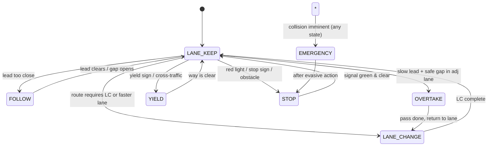

# 05 — Path Planning & Routing (Classical, No RL)

> Tesla-like prototype. **No reinforcement learning.** All decisions are rule-based
> finite state machines + optimization (MPC / trajectory optimization) on an HD map.
> This document covers global routing, behavioral planning, motion planning, lane
> change, intersection handling, overtake, emergency maneuvers, and rule-based
> decisions. It also maps the design onto the existing code in
> `src/alg/reference.py` and `src/alg/lka_step.py`.

---

## 0. Architecture Overview

```
┌────────────┐   ┌──────────────┐   ┌────────────────┐   ┌───────────┐   ┌──────────┐
│ HD Map +   │→ │ Global       │→ │ Behavioral     │→ │ Motion    │→ │ Control  │
│ Localization│  │ Routing (A*) │  │ Planner (FSM)  │  │ Planner   │  │ (MPC)    │
└────────────┘   └──────────────┘   └────────────────┘  └───────────┘  └──────────┘
                       │                   │                   │             │
                       ▼                   ▼                   ▼             ▼
              Lane-level route     State: LANE_KEEP,     RRT* / Lattice /    steer,
              (lane graph)         LANE_CHANGE,          Trajectory Opt      throttle,
                                   OVERTAKE, YIELD,                          brake
                                   STOP, EMERGENCY
```

Three-layer hierarchy (classic autonomy stack):

1. **Global routing** — "which sequence of lanes gets me to the destination?"
2. **Behavioral planning** — "what high-level maneuver am I doing right now?"
3. **Motion planning** — "what concrete trajectory (x, y, v, a) do I execute?"

The existing `LKAStep` class implements layers 2+3 in a single frame step
(perception → fusion → reference → MPC → safety override). This document
formalizes and extends that pipeline.

---

## 1. Global Routing

### 1.1 HD Map Representation

The HD map is a **lane-level directed graph**:

- **Nodes** = lane connectors (exits of a lane segment / intersection entry points).
- **Edges** = lane segments, each carrying:
  - `length_m`, `speed_limit_kmh`, `lane_width_m`
  - `lane_type` (driving, shoulder, HOV, turn-only)
  - `successors[]` (reachable next lanes), `left_neighbor`, `right_neighbor`
  - `cost_base` (static preference: highway < arterial < residential)

### 1.2 Dijkstra (baseline)

Used when the graph is small / dense and all edge costs are non-negative.

```
function DIJKSTRA(map, start_lane, goal_lane):
    dist[start] ← 0; dist[all] ← ∞
    PQ ← min-heap keyed by dist
    while PQ not empty:
        u ← PQ.pop_min()
        if u == goal: return reconstruct(prev)
        for v in u.successors:
            w ← edge_cost(u, v)        # length + lane_change_penalty + toll
            if dist[u] + w < dist[v]:
                dist[v] ← dist[u] + w
                prev[v] ← u
                PQ.decrease_key(v, dist[v])
    return FAILURE
```

### 1.3 A* (preferred)

A* adds a heuristic to prune the search. Heuristic must be **admissible**
(never overestimates) — straight-line (great-circle) distance to goal divided
by max road speed is a valid choice.

```
function A_STAR(map, start, goal):
    g[start] ← 0
    f[start] ← h(start, goal)          # h = euclidean_dist / v_max
    OPEN ← {start}; CLOSED ← {}
    while OPEN:
        n ← argmin_{x in OPEN} f[x]
        if n == goal: return reconstruct(came_from, n)
        OPEN ← OPEN \ {n}; CLOSED ← CLOSED ∪ {n}
        for m in n.successors:
            if m in CLOSED: continue
            tentative_g ← g[n] + edge_cost(n, m)
            if m not in OPEN or tentative_g < g[m]:
                came_from[m] ← n
                g[m] ← tentative_g
                f[m] ← g[m] + h(m, goal)
                OPEN ← OPEN ∪ {m}
    return FAILURE
```

### 1.4 Edge Cost

```
edge_cost(u, v) =
    length_m / v_ref(v)                 # travel time
  + PENALTY_LANE_CHANGE if v requires LC from u
  + PENALTY_TOLL        if v.is_toll
  + PENALTY_UTURN       if v is a U-turn
  + PENALTY_LEFT_TURN   if v is a left turn at an intersection
  - BONUS_HOV           if v.is_hov and ego.is_hov_eligible
```

### 1.5 Re-routing

Triggered on:
- Deviation from route > `REROUTE_OFF_ROUTE_M` (e.g. 30 m).
- Lane closure detected by perception.
- User destination change.

Re-routing runs on a **background thread** (not in the 20 Hz control loop);
the ego continues the last valid maneuver until a new route is published.

---

## 2. Behavioral Planning — Finite State Machine

### 2.1 States

| State        | Description                                              |
|--------------|----------------------------------------------------------|
| `LANE_KEEP`  | Follow current lane centerline at target speed.          |
| `LANE_CHANGE`| Lateral move to adjacent lane (left or right).           |
| `OVERTAKE`   | Change lane to pass a slower lead, then return.          |
| `YIELD`      | Decelerate to give way to a higher-priority actor.       |
| `STOP`       | Come to a complete stop (sign, light, obstacle).         |
| `FOLLOW`     | Maintain safe gap behind a slower lead (sub-state).      |
| `EMERGENCY`  | Highest-priority evasive maneuver; overrides everything. |

### 2.2 State Diagram (Mermaid)



### 2.3 Transition Conditions (rule-based)

```
# LANE_KEEP -> LANE_CHANGE
if route.next_maneuver == LANE_CHANGE_REQUIRED and d_to_maneuver < LC_TRIGGER_M:
    if gap_safe(target_lane) and risk_score < LC_RISK_MAX:
        state ← LANE_CHANGE

# LANE_KEEP -> OVERTAKE
if lead.speed < ego.speed - OVT_DELTA and lead.gap < OVT_GAP_MIN:
    if oncoming_clear(adj_lane) and gap_safe(adj_lane):
        state ← OVERTAKE

# * -> EMERGENCY
if ttc(ego, obstacle) < TTC_EMERGENCY_S:
    state ← EMERGENCY   # preempts all other transitions
```

### 2.4 Implementation Hook

The current `LKAStep` runs a single implicit state (`LANE_KEEP` / `FOLLOW`).
The behavioral FSM should be inserted **between fusion and reference-path
generation** (see `src/alg/lka_step.py` line ~63, the `from .reference import`
block), producing a `Behavior` struct consumed by the motion planner.

---

## 3. Motion Planning

Three complementary families. We pick per scenario.

### 3.1 Sampling — RRT*

Good for unstructured / emergency maneuvers (no lane graph to lean on).

```
function RRT_STAR(x_start, x_goal, obstacles, max_iter):
    V ← {x_start}; E ← {}
    for i in 1..max_iter:
        x_rand ← sample_free(obstacles)          # bias 10% toward x_goal
        x_nearest ← nearest(V, x_rand)
        x_new ← steer(x_nearest, x_rand, STEP_M)
        if collision_free(x_nearest, x_new, obstacles):
            X_near ← near(V, x_new, RADIUS)
            x_min  ← choose_parent(X_near, x_nearest, x_new)
            V ← V ∪ {x_new}; E ← E ∪ {(x_min, x_new)}
            rewire(X_near, x_new)
    return path(V, E, x_start, x_goal)           # smoothed post-hoc
```

- `steer()` uses a bicycle model so samples are kinematically feasible.
- Cost = arc length + curvature penalty (comfort).
- Post-process: shortcut + B-spline smoothing before handing to MPC.

### 3.2 Graph — A* on Motion Lattice

A **lattice planner** discretizes state `(s, lateral_offset, speed)` and
expands a fixed set of motion primitives (keep, shift-left, shift-right,
accel, decel). A* over the lattice yields a minimum-cost feasible trajectory.

```
function LATTICE_A_STAR(s0, lat0, v0, goal_s, behavior):
    OPEN ← {(s0, lat0, v0)}; g[...] ← 0
    while OPEN:
        n ← pop_min(OPEN)        # f = g + h(s_to_goal)
        if n.s >= goal_s: return decode_trajectory(n)
        for prim in PRIMITIVES:   # {keep, LC_left, LC_right, accel, brake}
            m ← apply(prim, n)
            if feasible(m, obstacles, lane_bounds, behavior):
                if g[n] + prim.cost < g[m]:
                    g[m] ← g[n] + prim.cost
                    parent[m] ← n
                    push(OPEN, m, g[m] + h(m))
    return FAILURE
```

Motion primitives are precomputed offline so each is guaranteed
curvature-continuous and within `MPC_MAX_STEER` / `MPC_MAX_ACCEL`
(see config imports in `lka_step.py` lines 43–55).

### 3.3 Optimization — Trajectory Optimization

For the nominal lane-keep / lane-change case we use **trajectory optimization**
(quintic polynomial in lateral, piecewise-linear in longitudinal), which is
exactly what `reference.py` already implements:

- `get_quintic_coefficients()` (line 73) solves the lateral boundary-value
  problem `y(s) = a0 + a1 s + ... + a5 s^5` with boundary conditions on
  `y, y', y''` at start and end.
- The resulting polynomial is resampled by `resample_path()` (line 40) to
  uniform `s` over the lookahead window and smoothed by `smooth_path_lat()`
  (line 21) with an EMA to suppress jitter.

General form:

```
min_{x(t), u(t)}   ∫ (w_cte·CTE² + w_heading·eh² + w_v·(v-v_ref)²
                     + w_steer·δ² + w_accel·a²) dt
subject to         ẋ = f_bicycle(x, u)              # kinematic model
                   |δ|   ≤ MPC_MAX_STEER
                   |δ̇|   ≤ MPC_MAX_STEER_RATE
                   |a|   ≤ MPC_MAX_ACCEL
                   collision_free(x(t), obstacles)
                   lane_bounds(x(t))
```

This is solved as a QP (linearized around the reference) each frame — the
`LaneMPC` class imported at `lka_step.py` line 59. Weights come from
`MPC_W_CTE … MPC_W_STEER_JERK` (lines 47–55) and may be made adaptive via
`MPC_USE_ADAPTIVE_WEIGHTS`.

---

## 4. Lane Change Planning

### 4.1 Gap Selection

For a candidate target lane, define the **lead gap** (vehicle ahead) and
**trail gap** (vehicle behind) relative to ego's projected position after LC.

```
function gap_safe(target_lane, ego):
    lead  ← nearest_ahead(target_lane, ego.s)
    trail ← nearest_behind(target_lane, ego.s)
    gap_lead  ← lead.s  - ego.s - L_VEH   if lead  else ∞
    gap_trail ← ego.s - trail.s - L_VEH   if trail else ∞
    return gap_lead  >= GAP_LEAD_MIN(v_ego)
       and gap_trail >= GAP_TRAIL_MIN(v_ego, v_trail)
```

`GAP_TRAIL_MIN` grows with relative closing speed of the trailer so we don't
cut off a fast approacher.

### 4.2 Risk Assessment

A scalar risk score gates the LC:

```
risk = 0.4·(1 - gap_norm)        # normalized gap deficit
     + 0.3·(1 - ttc_norm)       # time-to-collision margin
     + 0.2·blind_spot_flag      # perception blind-spot detection
     + 0.1·weather_penalty      # rain/fog reduces confidence
if risk > LC_RISK_MAX: abort LC
```

### 4.3 Trajectory Generation

Lateral: quintic polynomial from current `(lat, lat', lat'')` to
`(lat_target, 0, 0)` over horizon `T = LC_TIME` (e.g. 4 s). This reuses
`get_quintic_coefficients()` from `reference.py`.

Longitudinal: keep `v_ref` of the target lane, with a small decel if the
new lead is closer than current lead.

```
lat(s) = quintic(lat0, lat0', lat0'', lat_target, 0, 0, S_lc)
v(s)   = clip(v_ref_target, v_min, v_max)
```

The LC is **committed** once lateral offset crosses 50 % of lane width;
abort is only allowed before that point (prevents oscillation).

---

## 5. Intersection Handling

### 5.1 Gap Acceptance

At an unsignalized intersection (stop / yield), the ego must accept a gap
in cross traffic before proceeding.

```
function accept_gap(cross_traffic, turn_type):
    for vehicle in cross_traffic:
        t_arrival ← vehicle.s / vehicle.v
        t_cross   ← ego_intersection_time(turn_type)
        margin    ← t_arrival - t_cross
        if margin < GAP_ACCEPT_MIN: return False
    return True
```

`GAP_ACCEPT_MIN` is speed- and turn-type-dependent (left turns need a larger
gap than right turns because of longer crossing distance + opposing traffic).

### 5.2 Turn Planning

- **Protected turn** (green arrow): no gap check; follow turn reference.
- **Permitted turn** (green ball): yield to oncoming + pedestrians.
- **Right turn on red**: stop first, then gap-accept against cross traffic.

Turn reference path is generated as a clothoid / arc between the entry and
exit lane centerlines; `resample_path()` (reference.py line 40) is used in
turns because `|curv|` is high and the map geometry must be followed exactly
(see comment at line 48).

### 5.3 Conflict Resolution (priority)

Priority order, highest first:

1. Emergency vehicles (siren detected).
2. Pedestrians in crosswalk.
3. Oncoming through traffic (when ego turns left).
4. Right-of-way vehicle on the priority road.
5. First-to-arrive at a 4-way stop (tie → vehicle on the right).

The ego yields to everything above it in this list before entering the
conflict zone.

---

## 6. Overtake Logic

### 6.1 Trigger

```
if lead.v < ego.v - OVT_DELTA             # lead is meaningfully slower
   and lead.gap < OVT_GAP_MIN             # we are stuck behind it
   and route allows lane change
   and adj_lane exists (typically left)
   and oncoming_clear(adj_lane)
   and gap_safe(adj_lane):
    enter OVERTAKE
```

### 6.2 Oncoming Traffic Check

For two-lane rural roads where overtake uses the opposing lane:

```
function oncoming_clear(opp_lane, overtake_distance, ego_v, lead_v):
    t_overtake ← overtake_distance / (ego_v - lead_v)   # relative pass time
    for oncoming in opp_lane:
        t_meet ← (oncoming.s - ego.s) / (ego_v + oncoming.v)
        if t_meet < t_overtake + OVT_MARGIN_S:
            return False
    return True
```

`overtake_distance` must include the full pass plus return-to-lane distance.

### 6.3 Return to Lane

After passing, return when:

```
lead_behind.s - ego.s > OVT_RETURN_GAP_M   # we are safely ahead
and gap_safe(original_lane) == True
```

The return LC uses the same quintic lateral trajectory as §4.3.

---

## 7. Emergency Maneuvers

`EMERGENCY` is the highest-priority behavioral state and preempts everything.
The planner selects one of three sub-maneuvers based on the obstacle and
available space.

### 7.1 Decision Tree

```
if ttc < TTC_EMERGENCY_S:
    if evasive_lane_change_feasible() and ttc_lane_change > ttc_brake:
        do EVASIVE_LANE_CHANGE
    elif pull_over_space_available() and speed < PULLOVER_MAX_V:
        do PULL_OVER
    else:
        do EMERGENCY_STOP
```

### 7.2 Evasive Lane Change

- Uses RRT* (§3.1) because the maneuver is unstructured.
- Lateral accel capped at `A_LAT_MAX` (comfort + tire-friction limit).
- No gap acceptance — a collision with a side vehicle at lower relative speed
  is preferable to a head-on at full speed.

### 7.3 Emergency Stop

```
a_brake ← -A_EMERGENCY_MAX        # full braking, ABS-managed
hazard_lights ← ON
steer ← keep current lane (straight)
post-stop: call emergency services (telematics)
```

### 7.4 Pull-Over

Used when continuing in-lane is unsafe but a full stop in-lane is also unsafe
(e.g. tire blowout). Plan a short trajectory to the shoulder, then stop.

### 7.5 Safety Override Hook

The existing `SafetyOverride` class (`lka_step.py` line 60) is the integration
point: it runs **after** MPC and clamps `steer`/`throttle`/`brake` against
hard limits (`SAFETY_MAX_STEER_RAD`, `STEER_MAX_DELTA_PER_FRAME`). The
emergency planner should feed its trajectory directly into the override
layer, bypassing the nominal MPC path.

---

## 8. Rule-Based Decisions

All decisions are deterministic rules over the HD map + perception state.
No learned policy is in the loop.

### 8.1 Traffic Rules

| Rule                       | Implementation                                                |
|----------------------------|---------------------------------------------------------------|
| Speed limit                | `v_ref = min(speed_limit, target_speed, curve_speed)`         |
| Stop line                  | Force `STOP` state when `s_to_stop_line < STOP_TRIGGER_M`.    |
| Traffic light              | Red/amber → `STOP`; green → proceed; amber → stop if safe.    |
| Yield / give-way           | `YIELD` state + gap acceptance (§5.1).                        |
| Minimum following distance | `FOLLOW` with `gap = max(TIME_GAP·v, DIST_GAP_MIN)`.          |
| No-overtake zones          | Disable `OVERTAKE` when map flag set or solid line detected.  |
| School / construction zone | Reduce `v_ref`, raise `TTC_EMERGENCY_S` threshold.             |

### 8.2 Right-of-Way

Encoded as a static priority table per intersection topology (§5.3). The
behavioral planner queries it before any `YIELD`/`STOP` transition.

### 8.3 Speed Limits & Curve Speed

Curve speed is derived from curvature (already used in `lka_step.py` via
`CURVE_BRAKE_CURV_*` / `CURVE_BRAKE_SPEED_*` config, lines 32–39):

```
v_curve = sqrt(A_LAT_MAX / |κ|)
v_ref   = min(speed_limit, v_curve, target_speed)
```

Dynamic lookahead (`dynamic_lookahead_m`, reference.py line 16) scales with
speed so the planner sees far enough ahead to brake for a curve:
`lookahead = max(LOOKAHEAD_MIN_M, v · LOOKAHEAD_TIME_S)`.

---

## 9. Existing Code Mapping

### 9.1 `src/alg/reference.py`

| Function                     | Role in this design                                      |
|------------------------------|----------------------------------------------------------|
| `dynamic_lookahead_m` (16)   | Speed-adaptive planning horizon (§8.3).                  |
| `smooth_path_lat` (21)       | EMA lateral smoothing of the reference (§3.3).           |
| `resample_path` (40)         | Uniform `s`-spacing for MPC; used in turns (§5.2).       |
| `get_quintic_coefficients`(73)| Lateral trajectory optimization (§3.3, §4.3).           |

### 9.2 `src/alg/lka_step.py`

`LKAStep` (line 94) is the per-frame orchestrator:

```
(rgb, speed, wp, steer, throttle)
  → BEVRoadPerception          # perception
  → apply_fusion               # sensor/map fusion (line 64)
  → get_reference_path         # reference generation (line 63)
  → LaneMPC                    # trajectory optimization (line 59)
  → SafetyOverride             # hard limits (line 60)
  → (steer, throttle, brake)
```

This maps onto the three-layer stack as:

- **Behavioral** — currently implicit (`LANE_KEEP`/`FOLLOW`); the FSM from §2
  should be inserted before `get_reference_path`.
- **Motion** — `LaneMPC` + quintic reference = the optimization approach (§3.3).
- **Safety** — `SafetyOverride` = the emergency hook (§7.5).

`make_fallback_trajectory_out` (line 67) is the graceful-degradation path
when perception is stale — a critical safety property that an RL policy would
have to learn but here is explicit.

---

## 10. RL vs Classical — Why Rule-Based + Optimization Is Safer for Production

| Aspect                | RL (policy network)                      | Classical (FSM + optimization) [this design] |
|-----------------------|------------------------------------------|-----------------------------------------------|
| **Verifiability**     | Hard to prove safety; behavior is emergent. | FSM transitions + cost functions are auditable line-by-line. |
| **Interpretability**  | Black box; post-hoc explanations needed. | Every decision has a named rule + traceable inputs. |
| **Edge cases**        | Only as good as training distribution; catastrophic on OOD. | Rules + optimization degrade gracefully (fallback trajectory, §9.2). |
| **Safety guarantees** | None formal; requires enormous sim coverage. | Hard constraints (`MPC_MAX_STEER`, `TTC_EMERGENCY_S`) are enforced every frame. |
| **Determinism**       | Stochastic policy → non-reproducible crashes. | Same inputs → same outputs; crashes are reproducible & fixable. |
| **Regulation**        | Regulators (NHTSA, UNECE) require explainability; RL struggles. | Rule-based decisions map directly to traffic law (§8). |
| **Data cost**         | Millions of km + sim; expensive, brittle. | No driving data needed; rules from law + kinematics. |
| **Generalization**    | Re-training required per market/road set. | Swap the HD map + rule table; same planner runs. |
| **Comfort**           | Learned, often jerky; needs reward shaping. | Cost weights (`MPC_W_*`) tuned once, bounded by construction. |
| **Failure mode**      | Silent policy degradation.               | Explicit `FAILURE` returns + fallback trajectory. |
| **Time to deploy**    | Long (collect → train → validate → deploy). | Short (write rules + tune weights). |

### 10.1 Key Argument

A production vehicle must satisfy **hard constraints** every frame: never
exceed steering/accel limits, never enter a collision tube, always yield at
a stop sign. Optimization-based planners enforce these as inequalities in the
QP — a violation is a solver failure, which is caught and falls back. An RL
policy has no such mechanism; it merely *tends* to satisfy them on the
training distribution, with no guarantee off it.

### 10.2 Where RL Could Still Help (out of scope here)

RL is useful for **tuning cost weights** offline or for **imitation** of
expert demonstrations to seed a trajectory library — but the **online
controller** remains rule-based + optimization. This prototype deliberately
excludes even that to keep the stack fully auditable.

### 10.3 Conclusion

For a Tesla-like prototype aimed at **safe, explainable, deployable**
behavior, the classical stack (HD-map routing → FSM behavior → optimization
motion planning → safety override) is the correct choice. The existing
`reference.py` + `lka_step.py` code already embodies the core of this
approach; this document specifies the extensions (FSM, lane-change, overtake,
intersection, emergency) needed to take it from lane-keep to full routing.

---

*End of document.*
